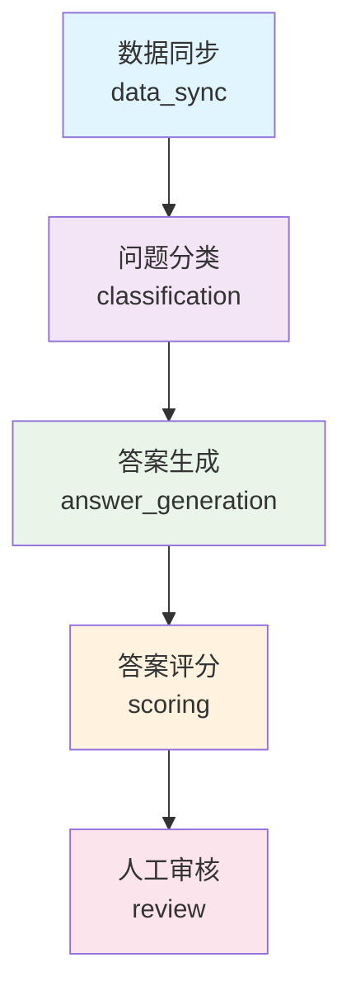

# 🕐 定时任务调度系统使用指南

## 📋 系统概述

AI问答平台的定时任务调度系统是一个**企业级的工作流管理平台**，支持：

- ⏰ **自动化定时执行** - 每日自动运行完整AI处理流程
- 🎛️ **手动控制** - 随时启动任意处理阶段
- 📊 **实时监控** - 完整的状态监控和执行历史
- 🔧 **前端集成** - 为可视化管理界面提供完整API

## 🏗️ 工作流架构

### 📊 工作流阶段设计



| 阶段 | 功能 | 自动进入下一阶段 | 依赖条件 |
|------|------|------------------|----------|
| **数据同步** | 从table1同步最新数据到questions和answers表 | ✅ 是 | 无 |
| **问题分类** | 调用分类API对新问题进行智能分类 | ✅ 是 | 数据同步完成 |
| **答案生成** | 调用豆包AI和小天AI生成问题答案 | ✅ 是 | 问题分类完成 |
| **答案评分** | 对生成的答案进行五维质量评分 | ❌ 否 | 答案生成完成 |
| **人工审核** | 人工审核处理结果，质量把控 | ❌ 否 | 答案评分完成 |

### ⏰ 定时任务配置

```python
# 主工作流任务 - 每天凌晨2点自动执行
'daily_workflow': {
    'schedule': '每日 02:00',
    'enabled': True,
    'description': '自动执行完整的AI数据处理工作流'
}

# 独立数据同步任务 - 每天凌晨1:30执行
'daily_data_sync': {
    'schedule': '每日 01:30', 
    'enabled': False,  # 默认禁用，由主工作流控制
    'description': '独立的数据同步任务'
}
```

## 🚀 使用方法

### 1. **查看系统状态**

```bash
# 获取调度器完整状态
curl http://localhost:5000/api/scheduler/status

# 获取工作流状态
curl http://localhost:5000/api/scheduler/workflow/status

# 健康检查
curl http://localhost:5000/api/scheduler/health
```

**响应示例**：
```json
{
    "success": true,
    "data": {
        "scheduler_running": true,
        "current_time": "2024-01-09T15:30:00Z",
        "scheduled_jobs": {
            "count": 2,
            "jobs": {
                "daily_workflow": {
                    "name": "每日AI处理工作流",
                    "enabled": true,
                    "next_run": "2024-01-10T02:00:00Z"
                }
            }
        },
        "workflow": {
            "phases": {
                "data_sync": {
                    "status": "success",
                    "last_execution": "2024-01-09T02:00:15Z",
                    "can_execute": true
                },
                "classification": {
                    "status": "success", 
                    "last_execution": "2024-01-09T02:05:30Z",
                    "can_execute": true
                }
            }
        }
    }
}
```

### 2. **手动执行完整工作流**

```bash
# 执行完整工作流
curl -X POST http://localhost:5000/api/scheduler/workflow/execute \
     -H "Content-Type: application/json"
```

### 3. **手动执行特定阶段**

```bash
# 手动执行数据同步
curl -X POST http://localhost:5000/api/scheduler/workflow/phases/data_sync/execute

# 手动执行问题分类
curl -X POST http://localhost:5000/api/scheduler/workflow/phases/classification/execute

# 手动执行答案生成
curl -X POST http://localhost:5000/api/scheduler/workflow/phases/answer_generation/execute

# 手动执行答案评分
curl -X POST http://localhost:5000/api/scheduler/workflow/phases/scoring/execute
```

### 4. **独立处理操作**

```bash
# 独立数据同步（不依赖工作流）
curl -X POST http://localhost:5000/api/scheduler/manual/sync \
     -H "Content-Type: application/json" \
     -d '{"force_full_sync": false}'

# 独立分类处理
curl -X POST http://localhost:5000/api/scheduler/manual/classification \
     -H "Content-Type: application/json" \
     -d '{"limit": 100, "days_back": 1}'

# 独立答案生成
curl -X POST http://localhost:5000/api/scheduler/manual/answer-generation \
     -H "Content-Type: application/json" \
     -d '{"limit": 50, "days_back": 1}'

# 独立评分处理
curl -X POST http://localhost:5000/api/scheduler/manual/scoring \
     -H "Content-Type: application/json" \
     -d '{"limit": 50, "days_back": 1}'
```

### 5. **定时任务管理**

```bash
# 暂停定时任务
curl -X POST http://localhost:5000/api/scheduler/jobs/daily_workflow/pause

# 恢复定时任务
curl -X POST http://localhost:5000/api/scheduler/jobs/daily_workflow/resume

# 获取所有定时任务
curl http://localhost:5000/api/scheduler/jobs
```

### 6. **统计和监控**

```bash
# 获取处理统计（最近7天）
curl http://localhost:5000/api/scheduler/statistics?days_back=7

# 获取API客户端统计
curl http://localhost:5000/api/scheduler/api-stats

# 获取前端仪表板数据
curl http://localhost:5000/api/scheduler/dashboard
```

## 🎨 前端集成支持

### 📊 仪表板数据API

```bash
# 获取完整的仪表板数据
curl http://localhost:5000/api/scheduler/dashboard
```

**返回数据结构**：
```json
{
    "overview": {
        "scheduler_running": true,
        "total_jobs": 2,
        "workflow_phases_count": 5,
        "last_workflow_execution": "2024-01-09T02:00:00Z"
    },
    "workflow": {
        "phases": { /* 各阶段详细状态 */ },
        "recent_executions": [ /* 最近5次执行记录 */ ]
    },
    "processing_stats": {
        "questions": { "total": 1250, "classified": 1200 },
        "answers": { "total": 2400, "scored": 1800 }
    },
    "scheduled_jobs": { /* 定时任务状态 */ }
}
```

### 🔧 配置信息API

```bash
# 获取系统配置
curl http://localhost:5000/api/scheduler/config
```

## 📈 使用场景

### 🌅 **场景1：日常自动化运维**

每天凌晨2点，系统自动执行完整工作流：
1. 同步昨日新增的问答数据
2. 对新问题进行智能分类
3. 生成豆包AI和小天AI的答案
4. 对答案进行质量评分
5. 等待人工审核

### 🎛️ **场景2：按需手动处理**

运维人员或业务人员可随时：
- 手动触发数据同步，获取最新数据
- 针对特定分类的问题重新生成答案
- 批量处理积压的评分任务
- 临时处理紧急数据

### 📊 **场景3：系统监控告警**

通过健康检查API实现：
- 定时任务运行状态监控
- 工作流执行异常告警
- 处理性能统计分析
- API调用成功率监控

### 🚀 **场景4：业务扩展支持**

系统架构支持：
- 新增AI服务接入（如GPT-4、Claude等）
- 自定义工作流阶段
- 灵活的处理策略配置
- 多租户隔离处理

## ⚙️ 配置参数

### 📁 环境变量配置

```bash
# 定时任务配置
SYNC_INTERVAL_MINUTES=30        # 数据同步间隔（分钟）
BATCH_SIZE=100                  # 批处理大小

# API配置
API_TIMEOUT=30                  # API超时时间（秒）
API_RETRY_TIMES=3              # API重试次数

# 外部API地址
CLASSIFY_API_URL=http://localhost:8001
DOUBAO_API_URL=http://api.doubao.com
XIAOTIAN_API_URL=http://api.xiaotian.com
SCORE_API_URL=http://api.score.com
```

### 🔧 代码配置

```python
# 工作流阶段依赖配置
workflow_config = {
    WorkflowPhase.DATA_SYNC: {
        'depends_on': [],                    # 无依赖
        'auto_next': True                    # 自动进入下一阶段
    },
    WorkflowPhase.CLASSIFICATION: {
        'depends_on': [WorkflowPhase.DATA_SYNC],  # 依赖数据同步
        'auto_next': True
    },
    # ... 其他阶段配置
}
```

## 🔍 故障排除

### ❌ **常见问题**

1. **定时任务未启动**
   ```bash
   # 检查调度器状态
   curl http://localhost:5000/api/scheduler/status
   
   # 检查日志
   tail -f backend/app.log | grep scheduler
   ```

2. **工作流阶段失败**
   ```bash
   # 查看工作流状态
   curl http://localhost:5000/api/scheduler/workflow/status
   
   # 手动重新执行失败的阶段
   curl -X POST http://localhost:5000/api/scheduler/workflow/phases/classification/execute
   ```

3. **API调用失败**
   ```bash
   # 检查API统计
   curl http://localhost:5000/api/scheduler/api-stats
   
   # 检查网络连接和API密钥配置
   ```

### 📊 **监控指标**

- **调度器运行状态**: `scheduler_running`
- **工作流成功率**: `workflow_success_rate`
- **平均处理时间**: `average_processing_time`
- **API调用成功率**: `api_success_rate`

## 🎯 最佳实践

### 1. **生产环境部署**
- 配置合适的定时任务时间，避开业务高峰期
- 设置合理的批处理大小，平衡性能和资源使用
- 配置监控告警，及时发现异常

### 2. **开发测试**
- 使用手动执行进行功能测试
- 通过独立处理API验证单个功能
- 利用统计API分析处理效果

### 3. **扩展开发**
- 新增AI服务时，继承`BaseAPIClient`类
- 新增工作流阶段时，更新`WorkflowPhase`枚举
- 前端集成时，使用`/dashboard`API获取完整数据

---

*这个定时任务调度系统为AI问答平台提供了强大而灵活的自动化处理能力，支持未来的业务扩展和技术演进！* 🚀 