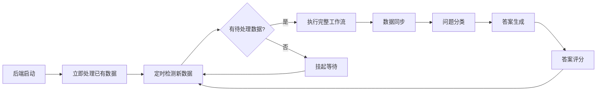

# 🤖 AI问答平台自动化工作流使用说明

## 📋 功能概述

现在AI问答平台已经实现了完整的自动化工作流，具备以下核心特性：

- ✅ **启动时立即处理**：后端启动后自动处理已有数据
- ✅ **智能数据检测**：自动检测是否有待处理数据
- ✅ **无数据挂起**：没有数据时自动挂起，节省资源
- ✅ **可配置间隔**：调度间隔可通过环境变量配置（默认3分钟）
- ✅ **全链路自动化**：数据插入→同步→分类→答案生成→评分

## 🚀 快速开始

### 1. 启动Mock服务
```bash
# 方法1：使用启动脚本（推荐）
./start_mock_services.sh

# 方法2：手动启动
cd backend/tests
python mock_classification_api.py --port 8001 &
python mock_ai_api.py --service doubao --port 8002 &
python mock_ai_api.py --service xiaotian --port 8003 &
python mock_score_api.py --port 8004 &
```

### 2. 启动后端服务
```bash
# 方法1：使用启动脚本
./start_backend.sh

# 方法2：手动启动
cd backend
source venv/bin/activate
python run.py
```

### 3. 验证自动化功能
```bash
# 运行自动化测试
cd backend
source venv/bin/activate
python test_auto_workflow.py
```

## 🔧 配置说明

### 环境变量配置
```bash
# 设置工作流执行间隔（分钟）
export WORKFLOW_INTERVAL_MINUTES=3

# 启用/禁用启动时自动处理
export AUTO_PROCESS_ON_STARTUP=true

# 启用/禁用数据检测
export DATA_CHECK_ENABLED=true
```

### 应用配置
在 `backend/app/config.py` 中可以修改以下配置：

```python
# 自动化处理配置
AUTO_PROCESS_ON_STARTUP = True          # 启动时立即处理
WORKFLOW_INTERVAL_MINUTES = 3           # 调度间隔（分钟）
DATA_CHECK_ENABLED = True               # 数据检测开关
AUTO_SUSPEND_WHEN_NO_DATA = True        # 无数据挂起开关
MIN_BATCH_SIZE = 1                      # 最小批处理大小
```

## 📊 监控和管理

### API端点

#### 1. 调度器状态
```bash
# 获取调度器状态
curl http://localhost:8088/api/scheduler/status

# 手动执行工作流
curl -X POST http://localhost:8088/api/scheduler/manual/workflow

# 手动执行特定阶段
curl -X POST http://localhost:8088/api/scheduler/manual/sync
curl -X POST http://localhost:8088/api/scheduler/manual/classify
curl -X POST http://localhost:8088/api/scheduler/manual/generate
curl -X POST http://localhost:8088/api/scheduler/manual/score
```

#### 2. Mock服务管理
```bash
# 检查所有Mock服务状态
curl http://localhost:8088/api/mock/status

# 检查单个服务状态
curl http://localhost:8088/api/mock/status/doubao

# 获取启动命令
curl http://localhost:8088/api/mock/startup-commands

# 获取启动脚本
curl http://localhost:8088/api/mock/startup-script
```

#### 3. 数据处理状态
```bash
# 数据同步状态
curl http://localhost:8088/api/sync/status

# 处理统计
curl http://localhost:8088/api/process/statistics

# 数据大盘
curl http://localhost:8088/api/dashboard
```

## 🔄 工作流说明

### 执行流程


### 各阶段说明

1. **数据同步阶段**
   - 从table1增量同步数据到questions/answers表
   - 自动去重，基于MD5业务主键
   - 过滤无效数据（query为空等）

2. **问题分类阶段**
   - 调用分类API对问题进行16领域分类
   - 支持批量处理，提高效率
   - 失败重试机制

3. **答案生成阶段**
   - 并发调用豆包、小天AI API
   - 为每个问题生成多种AI答案
   - 答案关联到对应问题

4. **答案评分阶段**
   - 调用评分API进行五维评分
   - 支持动态评分维度名称
   - 计算综合评分

## 🧪 测试和验证

### 1. 自动化测试
```bash
cd backend
source venv/bin/activate
python test_auto_workflow.py
```

测试内容包括：
- ✅ 配置检查：验证配置项正确性
- ✅ 挂起机制：验证无数据时的挂起功能
- ✅ 启动时处理：验证启动时立即处理功能
- ✅ 新数据处理：验证新数据插入后的自动处理

### 2. 手动测试
```bash
# 1. 插入测试数据到table1
cd backend
source venv/bin/activate
python tests/mock_data_manager.py --action add_data --count 5

# 2. 观察自动处理过程
tail -f app.log

# 3. 检查处理结果
python -c "
from app import create_app
from app.models import Question, Answer, Score
app = create_app()
with app.app_context():
    print(f'Questions: {Question.query.count()}')
    print(f'Answers: {Answer.query.count()}')
    print(f'Scores: {Score.query.count()}')
"
```

## 📈 性能优化

### 批处理配置
```python
# 调整批处理大小
BATCH_SIZE = 100  # 每批处理的记录数

# 调整最小批处理阈值
MIN_BATCH_SIZE = 1  # 小于此数量时挂起
```

### 调度优化
```bash
# 调整调度间隔（根据数据量和处理能力）
export WORKFLOW_INTERVAL_MINUTES=5  # 5分钟执行一次
```

### API超时配置
```python
# API调用超时设置
API_TIMEOUT = 30          # API超时时间（秒）
API_RETRY_TIMES = 3       # 重试次数
API_RETRY_DELAY = 1.0     # 重试延迟（秒）
```

## 🛠️ 故障排除

### 常见问题

#### 1. Mock服务无法连接
```bash
# 检查服务状态
curl http://localhost:8001/health
curl http://localhost:8002/health
curl http://localhost:8003/health
curl http://localhost:8004/health

# 重新启动Mock服务
./start_mock_services.sh
```

#### 2. 工作流执行失败
```bash
# 查看详细日志
tail -f backend/app.log

# 检查调度器状态
curl http://localhost:8088/api/scheduler/status

# 手动执行特定阶段
curl -X POST http://localhost:8088/api/scheduler/manual/sync
```

#### 3. 数据处理停滞
```bash
# 检查数据库连接
python -c "
from app import create_app
from app.utils.database import db
app = create_app()
with app.app_context():
    db.session.execute('SELECT 1')
    print('数据库连接正常')
"

# 检查table1数据
python -c "
import psycopg2
conn = psycopg2.connect(
    host='test-huiliu-postgresql.ns-q8rah3y5.svc',
    port=5432, user='postgres', password='l69jjd9n',
    database='ai_qa_platform'
)
cursor = conn.cursor()
cursor.execute('SELECT COUNT(*) FROM table1')
print(f'table1总记录数: {cursor.fetchone()[0]}')
conn.close()
"
```

### 日志分析
```bash
# 查看启动日志
grep -i "启动时立即处理" backend/app.log

# 查看工作流执行日志
grep -i "工作流" backend/app.log

# 查看挂起日志
grep -i "挂起" backend/app.log

# 查看错误日志
grep -i "error\|failed\|异常" backend/app.log
```

## 📞 技术支持

### 监控指标
- 📊 数据处理量：questions、answers、scores表记录数
- ⏱️ 处理时延：从数据插入到完成评分的时间
- 🔄 调度频率：工作流执行频率和成功率
- 💾 资源使用：CPU、内存使用情况

### 关键API
- **调度器管理**：`/api/scheduler/*`
- **Mock服务管理**：`/api/mock/*`
- **数据同步**：`/api/sync/*`
- **处理统计**：`/api/process/*`
- **数据大盘**：`/api/dashboard`

### 配置文件
- **主配置**：`backend/app/config.py`
- **环境变量**：`.env` 文件
- **启动脚本**：`start_backend.sh`、`start_mock_services.sh`

---

**🎉 至此，AI问答平台已实现完整的自动化工作流！**

只需启动后端服务和Mock服务，系统就会：
1. 立即处理已有数据
2. 定时检测新数据
3. 自动执行完整处理链路
4. 智能挂起等待新数据

当您往table1插入新数据时，系统会在下个调度周期（默认3分钟）自动检测并处理这些数据。 